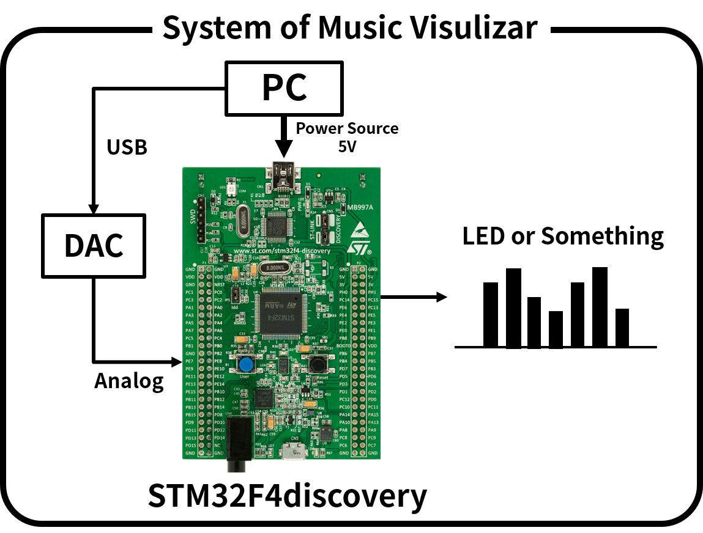
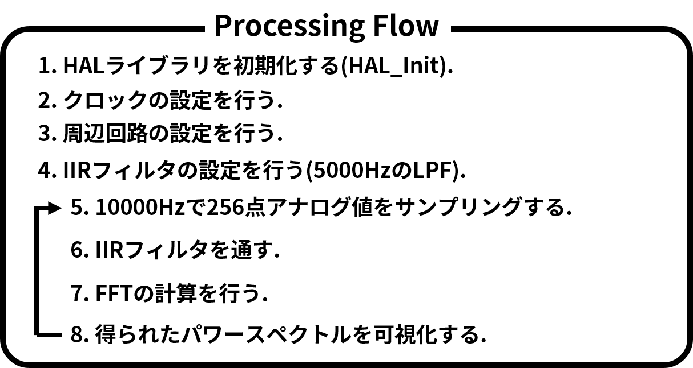

# STM32F4discoveryでミュージック・ビジュアライザーを作る
## Index
* システムとシーケンス
* HAL_Delay()関数の修正
* FFTとIIEフィルタの実装
* TIPS STM32F4でstd::coutのようにusartを使う  
* References

## システムとシーケンス  



## HAL_Delay()関数の修正  

## FFTとIIRフィルタの実装  

## TIPS STM32F4でstd::coutのようにusartを使う  
 - stm32f4のHALライブラリーを使用する.  
 - my_usart_stream.h  

```cpp
#ifndef MY_USART_STREAM_H
#define MY_USART_STREAM_H

#include "stm32f4xx.h"
#include <string>
#include <sstream>

/*
 * @brief std::cout for STM32 HAL
 */
class usartStream{
private:
	UART_HandleTypeDef husart;
public:
	usartStream(UART_HandleTypeDef huartx) { this->husart = huartx; }

	template<class T>
	usartStream operator<<(T val);
};

template<class T>
usartStream usartStream::operator <<(T val){
	std::stringstream ss;
	ss << val;
	HAL_UART_Transmit(&husart, (uint8_t*)ss.str().c_str(), ss.str().size(), 30);

	usartStream tmp(husart);
	return tmp;
}

#endif // MY_USART_STREAM_H
```

## References
* C言語によるFFTやIIRの実装について詳しく書かれている本  
<a href="http://floor13.sakura.ne.jp/book03/book03.html">[1] 青木 直史, C言語で始める音のプログラミング</a>

